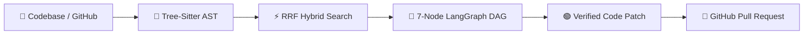

<div align="center">

# 🛡️ CodeGuardian
### **Autonomous Multi-Agent AI Security & Verification Engine**

```
 ⚡ 7-Node LangGraph DAG   •   🌳 Tree-Sitter AST Parsing   •   🧪 Pytest Subprocess Sandbox
```

---

[](https://fastapi.tiangolo.com/)
[](https://reactjs.org/)
[](https://www.typescriptlang.org/)
[](https://python.langchain.com/docs/langgraph)
[](https://supabase.com/)

---

</div>

> [!IMPORTANT]
> **CodeGuardian** is an enterprise AI platform built to audit codebases for **OWASP Top 10 vulnerabilities**, eliminate **LLM line citation hallucinations** using Tree-Sitter AST syntax trees, and issue **auto-verified GitHub Pull Requests**.

---

## 📌 Executive Summary Card

| Core Pillar | Technology | Value Delivered |
| :--- | :--- | :--- |
| 🤖 **Multi-Agent Flow** | **LangGraph DAG (7 Nodes)** | Autonomous step-by-step auditing, verification, and sandboxed test generation. |
| 🌳 **AST Code Grounding** | **Tree-Sitter Parser** | 100% verified line-number citations (Zero LLM hallucinations). |
| ⚡ **Hybrid Search RAG** | **Dense Embeddings + Sparse BM25** | Reciprocal Rank Fusion ($k=60$) across large codebase repositories. |
| 🧪 **Code Verification** | **Pytest Subprocess Sandbox** | Executes suggested code fixes in isolated sandboxes with exit code validation. |
| 🤖 **Automated CI/CD** | **GitHub Actions & Webhooks** | Posts inline AST security audit comments directly on real GitHub PR diffs. |

---

## 🏗️ System Architecture



---

## 🔄 3-Stage Developer Workflow

| Stage | Name | Description | Key Components |
| :---: | :--- | :--- | :--- |
| **1** | **Input Page** | Drag & drop multi-files, enter GitHub repo URL, or paste code snippet. | Multi-File Dropzone, GitHub Loader |
| **2** | **Live DAG Canvas** | Watch real-time execution across 7 agent nodes with pulsing glow lines. | Real-time SVG Canvas, Live Log Stream |
| **3** | **Results Workbench** | Inspect side-by-side code diffs, SAST audit findings, and issue GitHub PRs. | Monaco Diff Editor, File Tree, PR Modal |

---

## 🤖 7-Agent Verification Pipeline

```
  [1. Retrieval Agent]
         │
         ├───► [2. AST Bug Detector] ────► [4. Syntax Verifier] ────┐
         │                                                            ├─► [6. Pytest Sandbox] ─► [7. Doc Auditor]
         └───► [3. SAST Security Auditor] ─► [5. Line Verifier] ─────┘
```

> [!TIP]
> **Why 7 Agents?** Single-prompt LLMs make mistakes. CodeGuardian divides work into 7 specialized nodes so that security scanning, syntax linting, line grounding, and unit testing validate each fix independently.

---

## 🛠️ Complete Tech Stack

```
┌─────────────────────────────────────────────────────────────────────────────┐
│                              FRONTEND WORKSPACE                             │
│   React 18  •  TypeScript  •  Monaco Diff Editor  •  TailwindCSS  • Recharts  │
└─────────────────────────────────────────────────────────────────────────────┘
                                       │
                                       ▼ REST / WebSockets API
┌─────────────────────────────────────────────────────────────────────────────┐
│                               BACKEND API ENGINE                            │
│    FastAPI  •  Uvicorn  •  Pydantic v2  •  Python 3.10  •  ChromaDB RAG     │
└─────────────────────────────────────────────────────────────────────────────┘
                                       │
                                       ▼ Persistence & Telemetry
┌─────────────────────────────────────────────────────────────────────────────┐
│                           INFRASTRUCTURE & DATABASE                         │
│  Supabase PostgreSQL  •  SQLAlchemy  •  Arize Phoenix  •  GitHub Actions    │
└─────────────────────────────────────────────────────────────────────────────┘
```

---

## ⚡ Quickstart Guide (3 Commands)

### 1️⃣ Clone & Setup Virtual Environment
```bash
git clone https://github.com/YourUsername/CodeGuardian.git
cd CodeGuardian
python -m venv venv && source venv/bin/activate  # On Windows: venv\Scripts\activate
pip install -r requirements.txt
```

### 2️⃣ Start Backend Server
```bash
python -m uvicorn src.api.server:app --port 8000 --reload
```

### 3️⃣ Start Frontend UI
```bash
cd frontend && npm install && npm run dev
```
👉 Open `http://localhost:5173` in your browser.

---

## 📡 REST API Reference Table

| Method | Endpoint | Purpose |
| :---: | :--- | :--- |
| `GET` | `/api/v1/health` | Backend status & AST engine health check. |
| `POST` | `/api/v1/analyze` | Executes 7-node LangGraph analysis on target code. |
| `POST` | `/api/v1/github/webhook` | Receives GitHub PR webhooks with HMAC SHA-256 validation. |
| `POST` | `/api/v1/github/review-pr` | Triggers automated AI PR review comments on GitHub. |
| `GET` | `/api/v1/eval/report` | Returns RAG Triad benchmark metrics & telemetry latency spans. |
| `POST` | `/api/v1/feedback/submit` | Logs developer RLHF feedback (`Accept` / `Reject`). |

---

## 👥 Engineering Team & Ownership

Built as a high-impact engineering project by a 2-person team:

| Team Member | Domain | Key Accomplishments |
| :--- | :--- | :--- |
| **Teammate 1 (You)** | **AI Systems & Full-Stack Lead** | • Built 7-Node LangGraph DAG & Tree-Sitter AST Grounding Parser.<br>• Designed 3-Stage React Workspace, SVG Canvas & Monaco Diff Viewer.<br>• Built GitHub Webhook Bot (`/api/v1/github/webhook`) & PR Creation API. |
| **Teammate 2 (Partner)** | **Infrastructure & Database Lead** | • Built RAG Triad Benchmark Suite & Arize Phoenix Telemetry Tracing.<br>• Designed Supabase PostgreSQL schema (`SQLAlchemy`) for audit persistence.<br>• Implemented Pytest Subprocess Sandboxing. |

---

<div align="center">

**CodeGuardian** • *Autonomous Multi-Agent AI Security Engine*

</div>